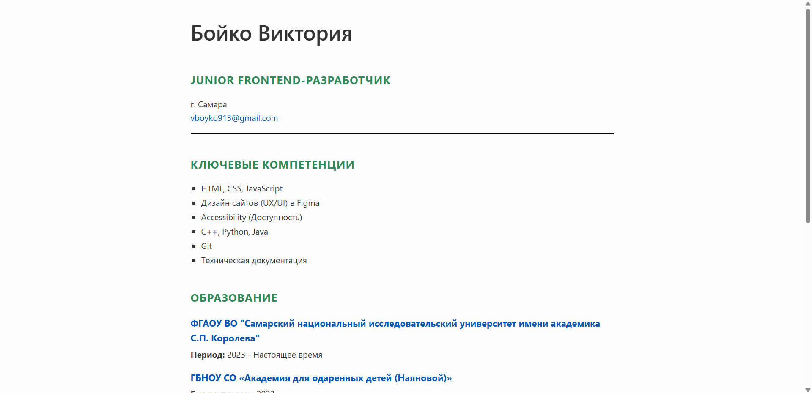

# Одностраничное Резюме на HTML

Это учебный проект по созданию структурированного одностраничного резюме (CV), идея которого взята с образовательной платформы [roadmap.sh](https://roadmap.sh/projects/single-page-cv).

Основная цель этого проекта — закрепить фундаментальные навыки работы с HTML для создания семантически верной и хорошо организованной веб-страницы, а также применить базовые стили CSS для придания ей чистого и профессионального вида.

🚀 **Скриншот готового проекта:**



---

## ✅ Чему я научилась в ходе проекта:

- [x] **Создавать семантически верную HTML-структуру**, используя теги `<header>`, `<main>`, `<section>`, `<article>`, `<h1>` и другие для правильного описания контента.
- [x] **Размечать одностраничный макет** с логическими секциями для образования, навыков и опыта работы.
- [x] **Добавлять важные мета-теги для SEO**, чтобы поисковые системы лучше понимали содержимое страницы.
- [x] **Внедрять Open Graph теги** для корректного и красивого отображения ссылки на резюме в социальных сетях.
- [x] **Подключать `favicon`** — иконку сайта для вкладки браузера.
- [x] **Применять базовые стили CSS** для создания чистого, читаемого и визуально приятного дизайна, включая работу со шрифтами, цветами, отступами и рамками.

---


## 📘 Теоретическая выжимка

В этом проекте я сфокусировалась на ключевых концепциях, которые являются фундаментом веб-разработки.

### 1. Семантический HTML

**Что это?** Это подход к написанию HTML, при котором используются теги, описывающие смысл (семантику) заключенного в них контента, а не только его внешний вид.

**Почему это важно?**
*   **SEO (Поисковая оптимизация):** Поисковые роботы лучше понимают структуру и важность контента, что положительно сказывается на рейтинге сайта.
*   **Accessibility (Доступность):** Программы для чтения с экрана (скринридеры) используют семантику для навигации по странице, делая сайт доступным для людей с ограниченными возможностями.
*   **Читаемость кода:** Код становится понятнее для других разработчиков (и для вас в будущем).

**Примеры использованных тегов:**
```html
<header> <!-- "Шапка" страницы с именем и контактами -->
  <h1>Ваше Имя</h1>
</header>

<main> <!-- Основное уникальное содержимое страницы -->
  <section> <!-- Логическая секция, например "Образование" -->
    <h2>Образование</h2>
    <article> <!-- Самостоятельная запись, например, ВУЗ -->
      <h3>Название ВУЗа</h3>
    </article>
  </section>
</main>
```

### 2. SEO и Open Graph Мета-теги

**Что это?** Это теги, которые размещаются в `<head>` и предоставляют структурированную информацию о странице для браузеров, поисковых систем и социальных сетей.

**Ключевые SEO-теги:**
```html
<!-- Устанавливает кодировку страницы для корректного отображения символов -->
<meta charset="UTF-8">

<!-- Краткое описание страницы, отображается в результатах поиска -->
<meta name="description" content="Резюме Junior Frontend-разработчика...">

<!-- Ключевые слова (влияние на SEO снизилось, но все еще полезны) -->
<meta name="keywords" content="резюме, frontend, junior, html, css">
```

**Ключевые Open Graph (OG) теги для соцсетей:**
```html
<!-- Заголовок, который будет виден при репосте -->
<meta property="og:title" content="Резюме - [Ваше Имя]">

<!-- Описание для превью в соцсети -->
<meta property="og:description" content="Ознакомьтесь с моим опытом...">

<!-- Ссылка на изображение для превью -->
<meta property="og:image" content="https://example.com/photo.jpg">

<!-- Канонический URL страницы -->
<meta property="og:url" content="https://your-resume-url.com">
```

### 3. Favicon

**Что это?** Это маленькая иконка, которая отображается на вкладке браузера, в закладках и в других элементах интерфейса.

**Почему это важно?** Favicon повышает узнаваемость бренда и делает сайт более профессиональным.

**Как подключить:**
```html
<link rel="icon" href="favicon.ico" type="image/x-icon">
```

---

## 🛠️ Использованные технологии

*   **HTML5**
*   **CSS3**